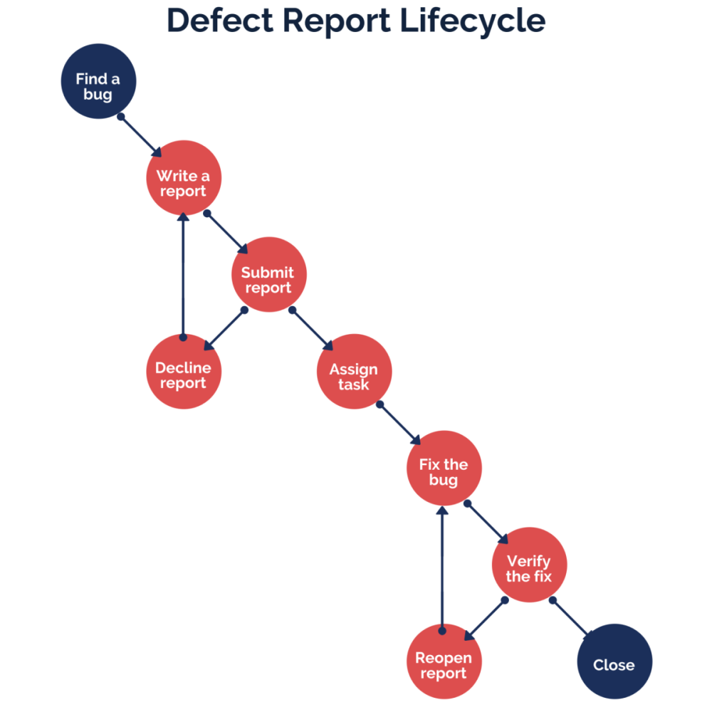

# qa-best-practices
Ths repository will consist of a QA documentation, example templates and best qa practices.

Sources:
https://www.freecodecamp.org/news/how-to-write-qa-documentation-that-will-work/

QA Documentation steps:
The documentation saves a ton of time by streamlining your testing processes. It’s, also, your go-to asset in case something goes off the rails with the project.

Целта на документацията е тя да спести време на qa's и developers като ги запознава директно с тестовия процес, начин на репортване на бъгове и отговаря на въпроси относно това как се тестват отделните страници в платформата. Документация е изгладена главно върху следните 5 точки:
* Defect Reports
* The Life-cycle of a Defect Report
* Typical Errors When Creating a Defect Report
* Test Plans
* Test Progress Report

1. DEFECT REPORTS
Докладът за дефект е пътната карта за получаване на софтуер без грешки. Накратко, докладът описва всеки нежелан бъг намерен по време на тестване. По-долу можете да видите пример за типичен доклад за дефект намерен на dev/staging и такъв намерен на production.

Пример за бъг намерен на dev/staging:
URL: learn-dev.dev.itbpcloud.space/card-collections/
Тестови данни: Dev тестова среда, десктоп устройство
Имейл на тестовия потребител: test-dashboard@gmail.com
Description: В Card Collections страницата, My collections таб-а, картичките трябва да се подредят по датата им на добавяне, като последната добавена отива най-накрая, а тези които са Out of Stock отиват на последно място по default. При наличието на повече от 4 картички в страницата, те трябва да се подредят на 2 реда на същия принцип описан по-горе:
Screenshots: Screenshot 1 and Screenshot 2

Пример за бъг намерен на prodution:
URL: https://learn.365datascience.com/courses/
Severity: High
Priority: High
Reproducibility: Always
Тестови данни: Live среда, десктоп устройство
Имейл на потребителя: pavel_lalev@gmail.com
Description: В Courses страницата, потребители не могат да стартират даден курс, като при клик на дадена course картичка платформата им хвърля Error 404.
Additional comments: Полезна информация, която ще служи на developer-a да пресъздаде/оправи дадения проблем, като стъпки чрез които да пресъздаде проблема.
Screenshots: Screenshot 1 and Screenshot 2

Кратка обяснение на отделните секции в Defect Report-a:
* Имаме имейл на потребителя, който е тествал дадения проблем
* Описанието на проблема трябва да е кратко и да отговаря на най-важните 3 въпроса:"Какво се случи?", "Къде?" и „При какви обстоятелства?“. Описанието е мястото, където се показва грешката с всички подробности. Тя трябва да се опише с действителните и очакваните резултати. Освен това е добра идея да се предоставите връзка към комуникация в GitHub, тикет в Jira или дизайн от Figma за повече детайли как трябва да работи/изглежда дадения feature.
* Във Reproducibility се показва дали грешката се появява всеки път когато се следва описания description от qa.
* Сериозността показва колко вреден е бъгът за проекта и дали вреди на нормалния user experience на потребителите.
* Приоритетът показва спешността и е логично допълнение към секцията за сериозност.
* Към описанието на дадения бъг е добре да се отбележи и дали има workaround - дали дадена страница може да се достъпи от повече едно място, ако тя не може да се отвори или ако имаме feature, който се използва на повече от едно място, дали той функционира правилно на останалите места.
* Скрийншоти, които показват визуално на developer-a проблема къде е проблема и каква грешка се появява.

В края на тестването един defect report трябва да изглежда по този начин.

2. THE LIFE-CYCLE OF A DEFECT REPORT

Изпращането на бъга е само първата стъпка преди отстраняването на грешката веднъж завинаги. Има цял жизнен цикъл.

Той започва, когато се отвори тикета в Jira или GitHub с описанието на проблема. След това екип-a по проекта, project manager или team lead имат възможност или да го възложат на developer, или да го отхвърлят. Ако описанието на дадения бъг не е пълна бъркотия и е описан с факти, то почти сигурно екипа ще го приеме. QA трябва да е готов да помогне в пресъздаването на бъга, ако developer-а срещне някакви трудности в това. Team Lead, Project Manager и QA Lead имат правомощията да откажат да пуснат оправянето на всеки бъг, ако той е неуместен или не на начина по който функционира дадената страница/feature.

След като бъга е пуснат веднъж за fix и той е оправен от developer, QA трябва да влезне на тестовата среда/live е да се увери, че той е оправено както трябва. Ако не, дадения тикет се връща към developer-a, като в Jira се премества в To Do секцията. За един и същи бъг не трябва да се пускат отделни тикети в Jira/GitHub с цел да се избегне дублиране, като просто се отваря стария тикет наново.

3. TYPICAL ERRORS WHEN CREATING A DEFECT REPORT
There are dozens of mistakes testers make in a defect report. Yet, only a couple of them are typical and persisting. Let’s go through the typical errors when creating a defect report:

A short and inadequate summary.
The summary and the description are pretty much the same.
The description has no expected result, no actual result, and no link to requirements. Nothing at all.
A print screen has no issue highlighted. This way, the developers might as well play ‘Find Waldo’ with the issue.
Describing imaginary defects.
Putting away your work for tomorrow, and the day after tomorrow, and …. you get the idea.
Making grammar mistakes. This is the easiest way to get shot by a grammar nazi.
Describing features as bugs because you know it’s the best way to get fired.
Not knowing the technical requirements of the tested solution. This type of tester is no better than this little dog-o below.
Missing out important information in your Steps to Reproduce.

4. TEST PLANS
Now you know all about defect reports and, hopefully, about test cases and test suits too. It’s time to give you the big picture of QA documentation. It’s time to make a test plan.

Your test plan should be your guiding document. It should include your to-do-list, strategy, resources, schedule and much more.

Your average test plan should answer thirteen questions:
What is the purpose of the software solution? Is there any?
What features should you test? Don’t go on a testing frenzy and test everything.
How does the testing process look like? What are the methodologies, approaches, technologies, tools and so on?
What are the acceptance criteria of your customer or your target audience?
When should you start and finish testing?
What are the criteria for stopping and continuing tests? Do you stop testing when you’re out of cookies?
What development resources do you need? What OS, how many copies and with what license? Yes, you have to worry about all of this.
What hardware and what experts do you need? Look for the best in class.
How much time and money does your project have for testing? Is it worthwhile?
Is there a test schedule? Perhaps, you should consider cramming all your testing into one day before deployment.
Are your roles and responsibilities well designated? Who’ll do the job, if your lead tester disappears?
Are there any testing risks? Is it risk-free not to test at all? 
What are the metrics and QA documentation your using? Maybe, go Rambo and document nothing.

5. TEST PROGRESS REPORT

The test progress report is like a test plan but with the current progress data added for comparison. In short, the report is a great way to keep your hand on the pulse of a project. So, you must mention eight things in your test summary report and you’re off to success.

Цели на документацията:
* главната цел на документацията е да се опише работния процес на QA отдела;
* бъдещето обучение на колеги ще бъде много по-лесно, тъй като цялата информация за намиране, предаване и тестване на оправени бъгове ще бъде събрана на едно място;
* работата на един QA трябва да е 50% тестване и 50% описване на намерените проблеми, assistance за пресъздаване на вече намерени бъгове;

Начини на репортване на бъговете:
Намерените бъгове се качват в Jira, QA Board под формата на defect report. Всеки отделен фийдбек съдържа следните компоненти:
* имейл на потребителя/тестовия акаунт;
* URL на страницата където е намерен проблема;
* устройството на който е намерен дадения бъг /десктоп или мобилна версия/;
* стъпки за пресъздаване на проблема;
* скрийншот на проблема;
* допълнителна информация около пресъздаване/fix-ване на проблема;

NB! Ако дадения бъг е намерен на production, то той:
* в момента на писане на документацията той се описва по-горе посочените начини и се качва в QA канала с цел по-бързото му fix-ване.
* при репортнат проблем от потребител в helpscout, то проблема се качва под формата на тикет в GitHub, като му се прилагат нужните тагове ("helpscout", "enhancement", и т.н.)

т1: Комуникация, видове:

* при fix-нати неща от QA фийдбек-a;
* при deploy на staging или production;
* при deploy на Hot Fix на production;
* при невъзможност/въпросителни относно даден бъг в QA фийдбека;
* обсъдена важна промяна с клиента, която не е описана в Jira ticket, GitHub тикет и др.

т3: Начин на тестване:

QA отваря тикета с комуникация (GitHub, Jira и т.н.) и започва последователно да преглежда точките по които ще се работи в дадения бъг/feature;

т4: Тестване след Deploy на Production:

т1: Комуникация, видове:
* при fix-нати неща от QA фийдбек-a;
* при deploy на staging или production;
* при deploy на Hot Fix на production;
* при невъзможност/въпросителни относно даден бъг в QA фийдбека;
* обсъдена важна промяна с клиента, която не е описана в Jira ticket, GitHub тикет и др.

т3: Начин на тестване:
- QA отваря тикета с комуникация (GitHub, Jira и т.н.) и започва последователно да преглежда точките по които ще се работи в дадения бъг/feature;

т4: Тестване след Deploy на Production:

